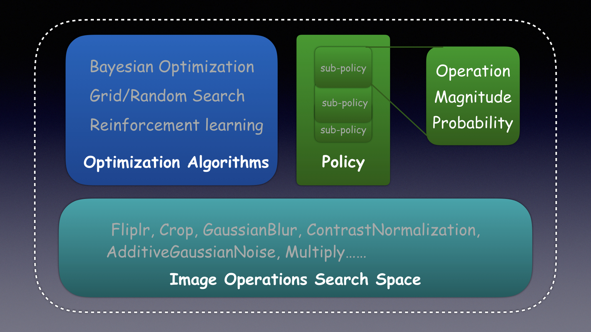

# Auto Image Augment

## Introduction

The project [auto_imgaug](https://github.com/tobegit3hub/auto_imgaug) provides auto image pre-processing methods by models without human knowledge.

It is the implementation of Google's paper [AutoAugment: Learning Augmentation Policies from Data](https://arxiv.org/pdf/1805.09501.pdf) but leveraging all the operations from [imgaug](https://github.com/aleju/imgaug) and optimization algorithms from [advisor](https://github.com/tobegit3hub/advisor). 



## Installation

Install with `pip`.

```
pip install auto_imgaug
```

Install from souce.

```
git clone https://github.com/tobegit3hub/auto_imgaug

cd ./auto_imgaug/

python ./setup.py install
```

## Usage

Run with `Policy` with default `Operations`.

```
import numpy as np
import imgaug as ia
from auto_imgaug.auto_imgaug import model

# Input images as tensor
input_images = np.array([ia.quokka(size=(64, 64)) for _ in range(32)], dtype=np.uint8)

# Use policy with 3 sub-policies(operations)
policy = model.AutoImgaugPolicy(3)

# Initialized policy with default operations
policy.init_with_default_operations()

# Run image pre-processing with policy
output_ndarray = policy.process(input_images)
```

Run with `Advisor` and machine learning algorithms.

```
study_configuration = {
  "goal": "MINIMIZE",
  "randomInitTrials": 1,
  "maxTrials": 5,
  "maxParallelTrials": 1,
  "params": [{
      "parameterName": "operation_name1",
      "type": "CATEGORICAL",
      "minValue": 0,
      "maxValue": 0,
      "feasiblePoints": "Fliplr, Crop, GaussianBlur, ContrastNormalization, AdditiveGaussianNoise, Multiply",
      "scallingType": "LINEAR"
  }, {
      "parameterName": "magnitude1",
      "type": "INTEGER",
      "minValue": 1,
      "maxValue": 11,
      "scallingType": "LINEAR"
  }, {
      "parameterName": "probability1",
      "type": "INTEGER",
      "minValue": 1,
      "maxValue": 10,
      "scallingType": "LINEAR"
  }, {
      "parameterName": "operation_name2",
      "type": "CATEGORICAL",
      "minValue": 0,
      "maxValue": 0,
      "feasiblePoints": "Fliplr, Crop, GaussianBlur, ContrastNormalization, AdditiveGaussianNoise, Multiply",
      "scallingType": "LINEAR"
  }, {
      "parameterName": "magnitude2",
      "type": "INTEGER",
      "minValue": 1,
      "maxValue": 11,
      "scallingType": "LINEAR"
  }, {
      "parameterName": "probability2",
      "type": "INTEGER",
      "minValue": 1,
      "maxValue": 10,
      "scallingType": "LINEAR"
  }, {
      "parameterName": "operation_name3",
      "type": "CATEGORICAL",
      "minValue": 0,
      "maxValue": 0,
      "feasiblePoints": "Fliplr, Crop, GaussianBlur, ContrastNormalization, AdditiveGaussianNoise, Multiply",
      "scallingType": "LINEAR"
  }, {
      "parameterName": "magnitude3",
      "type": "INTEGER",
      "minValue": 1,
      "maxValue": 11,
      "scallingType": "LINEAR"
  }, {
      "parameterName": "probability3",
      "type": "INTEGER",
      "minValue": 1,
      "maxValue": 10,
      "scallingType": "LINEAR"
  }]
}
```

More exmaples code in [examples](./examples).
